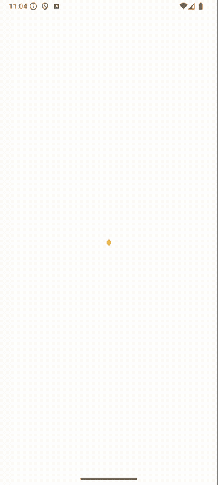
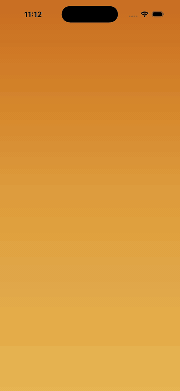

# SarvamSplash

Recreating the [Sarvam AI](https://www.sarvam.ai/) mandala splash animation in Compose Multiplatform. Runs on Android and iOS from a single Kotlin codebase (~390 lines of shared code).

| Android | iOS |
|---------|-----|
|  |  |

## How it works

The whole thing boils down to two problems: drawing the shape, and animating it.

### The shape

The Sarvam logo is an ogee — a diamond with scalloped (puffed-out) edges. Think of a pointed arch from Islamic architecture, but with four sides instead of two.

Here's how `OgeeShape.kt` builds it:

```
Step 1: Diamond        Step 2: Add circles      Step 3: Find cusps       Step 4: Connect arcs

       T                      T                        T                        T
      / \                 .  . .                   .  . .                     ,--,
     /   \               . /   \ .              x /  x  \ x                ,'    ',
    /     \             . /     \ .            . /     \ .               ,'        ',
   L       R           L .  .  . R           L x  x  x R             <          >
    \     /             . \     / .            . \     / .               ',        ,'
     \   /               . \   / .              x \  x  / x                ',    ,'
      \ /                 .  . .                   .  . .                     '--'
       B                      B                        B                        B

                        circles pushed            outer intersections      arcs between cusps
                        outward by "bulge"        = cusps (x)              = scalloped outline
```

1. Start with a vertical diamond (4 tip points: top, right, bottom, left)
2. Along each diamond edge, place circle centers evenly spaced, pushed outward by a `bulge` factor — this controls how "puffy" the scallops are
3. Each adjacent pair of circles overlaps. Find their outer intersection points — these are the cusps (the inward-pointing valleys between scallops)
4. Connect cusp-to-cusp with circular arcs (approximated as cubic beziers using the kappa constant)
5. Close the path. Done. 4 edges x 3 lobes = 12 scallops total

The `circleOuterIntersection` function does the geometry: given two overlapping circles, it finds both intersection points and picks the one farther from center (the outer cusp). The arc approximation uses `(4/3) * tan(angle/4)` for the bezier control point offset — a standard trick for approximating circular arcs.

One `Path` object. Built once, reused for every layer and every frame.

### The animation

`SarvamSplashScreen.kt` draws 8 copies of that path on a single `Canvas`, each with a different scale and color:

```
Timeline (one loop cycle ~2.5s)

0ms         600ms        1100ms       1900ms    1900ms       2300ms    2600ms
 |            |            |            |         |            |         |
 |-- EXPAND --|------->|   |            |         |            |         |
 | L0..L7     |        |   |            |         |            |         |
 | staggered  |        |   |            |         |            |         |
 | 60ms apart |        |   |            |         |            |         |
 |            |        |   |            |         |            |         |
 |            |--OVERLAY FADE IN--|     |         |            |         |
 |            |  (500ms)          |     |         |            |         |
 |            |                   |     |         |            |         |
 |            |            |      |- HOLD (solid)-|            |         |
 |            |            |      |  gradient     |            |         |
 |            |            |      |  800ms        |            |         |
 |            |            |      |               |            |         |
 |            |            |      |         SNAP! | OVERLAY    |  PAUSE  |
 |            |            |      |       layers  | FADE OUT   |  300ms  |
 |            |            |      |       -> 0    | (400ms)    |         |
 |            |            |      |       hidden  | reveals    |         |
 |            |            |      |       behind  | white      |         |
 |            |            |      |       overlay | canvas     |  REPEAT
 v            v            v      v         v     v            v    ---->

What the user sees:
 [mandala growing from center]  [solid gradient]  [gradient dissolves to white]
```

- **Staggered expansion:** Layer 0 (innermost) starts expanding first, layer 7 follows 60ms later. Inner layers scale to ~1x, outer layers overshoot to ~10x (way past screen edges). `FastOutSlowInEasing` makes the motion feel less robotic — fast start, gentle stop
- **Gradient overlay:** Partway through expansion (600ms in), a full-screen vertical gradient fades in over everything. By the time the outer layers finish expanding, the gradient covers the screen completely — you never see the jagged edges of the oversized outer layers
- **The loop trick:** This was the tricky part. To repeat seamlessly, we snap all layer scales back to 0 *while the overlay is still fully opaque*. Then fade the overlay out, revealing a clean white screen. The viewer never sees the reset happen. Early versions faded the overlay out first, which caused a visible jump — the fully-expanded mandala would flash to white in a single frame

The draw order matters: outermost layer first (painter's algorithm), innermost on top. Each layer gets a radial gradient from a golden center to a warmer orange edge — colors sampled from the actual Sarvam app.

### Performance

Nothing clever here, just avoiding the usual Compose pitfalls. One `Canvas` composable (no per-layer recomposition). The `Path` is built once and only scaled via canvas transform each frame. `Animatable` + coroutines handle timing instead of triggering recomposition on every tick. No allocations in the draw loop.

## Project structure

```
composeApp/
  src/
    commonMain/           # All the interesting code lives here
      kotlin/.../
        App.kt            # Entry point, white background + splash screen
        OgeeShape.kt      # Diamond-with-scallops path builder (~170 lines)
        SarvamSplashScreen.kt  # Animation orchestration + Canvas draw (~175 lines)
        theme/Colors.kt   # Layer gradients, overlay colors (~27 lines)
    androidMain/          # MainActivity, that's it
    iosMain/              # MainViewController, also just boilerplate
iosApp/                   # Xcode project wrapper for iOS
```

## Building

**Android:**
```bash
./gradlew installDebug
```

**iOS (simulator):**
```bash
# From Xcode
open iosApp/iosApp.xcodeproj
# Select a simulator, hit Run

# Or from terminal
xcodebuild -project iosApp/iosApp.xcodeproj -scheme iosApp \
  -destination "platform=iOS Simulator,name=iPhone 17 Pro" build
```

**iOS (from Android Studio):**
Install the Kotlin Multiplatform plugin, restart, and you'll get an `iosApp` run configuration in the toolbar. Needs Xcode installed on your Mac.

## Requirements

- Android Studio with KMP plugin
- Xcode (for iOS builds)
- JDK 17+
- Kotlin 2.1.0, Compose Multiplatform 1.7.3

## Acknowledgments

This README was written with [Claude](https://claude.ai). Turns out describing circle-circle intersection math in plain English is harder than writing the code.

## What I'd add next

- Logo text fade-in after the gradient settles
- Haptic feedback on the expansion peak
- Desktop/web targets (the shared code should just work, haven't tried yet)
